# Online Service Management System


The Online Electro-Care Service is a comprehensive web application with realtime Chatbot designed to streamline and manage various services provided by a business. It offers an efficient platform for service requests, scheduling, and customer management, all in one integrated system. The application includes a dashboard, login system, user panel, admin panel, and more.
<p align="center">
  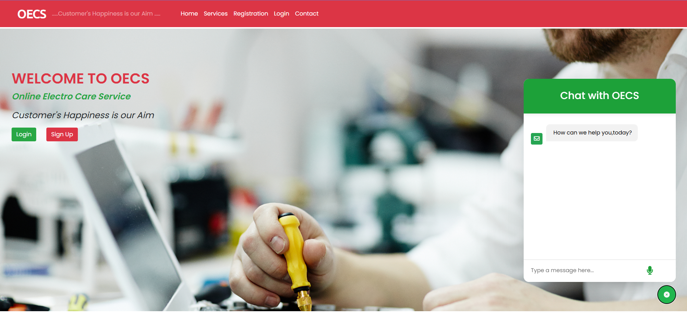
</p>

## Description
This web application is built using PHP (both Core and Advanced) and SQL for the backend, with HTML, CSS, Bootstrap, and JavaScript for the frontend. It allows businesses to handle service requests, track service delivery, manage customer data, and generate reports. The system is designed to be user-friendly and highly customizable to fit the specific needs of various service-oriented businesses.
## Key Features 

- **Dashboard :** An intuitive dashboard that provides an overview of all service activities, upcoming schedules, and performance metrics.

- **Service Request Management :** Easily manage and track service requests from customers.


- **Scheduling :** Schedule and assign service tasks to employees efficiently.

- **Customer Management :** Maintain detailed records of customer interactions and service history.

- **Reporting :** Generate comprehensive reports on service performance and customer satisfaction.

- **User Authentication :** Secure login system for administrators, service staff, and customers.

- **Admin Panel :** Comprehensive admin panel to manage users, services, and system settings.

- **User Panel :** User-friendly interface for customers to request services, view service history, and track ongoing services.

- **Responsive Design :** Fully responsive design using Bootstrap, ensuring compatibility across devices.


## Technologies Used 

* **PHP :** Core and Advanced PHP for server-side scripting and application logic.
* **SQL :** Database management and queries.
* **HTML :** Structure and content of the web pages.
* **CSS :** Styling and layout of the web pages.
* **Bootstrap :** Responsive design framework.
* **JavaScript :** Client-side scripting for dynamic content and interactivity.
* **XAMPP :** Local server environment for development and testing

## Screenshot:

<p align="center">
  
  <br>
  <br>
  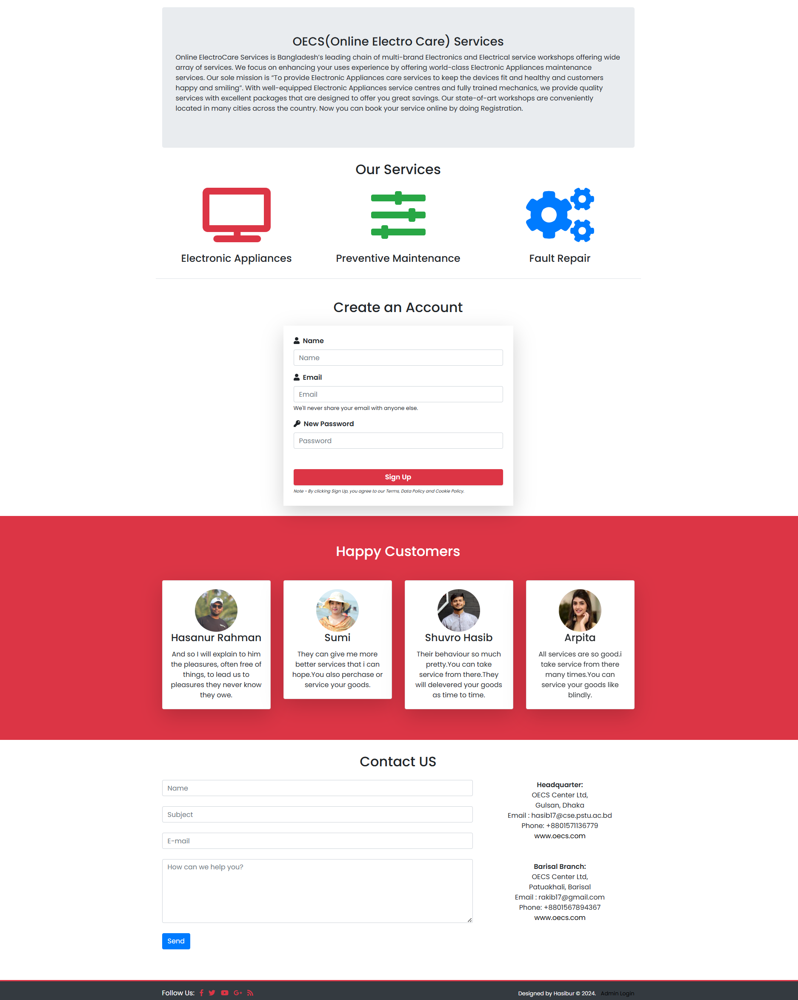
  <br>
  <br>
  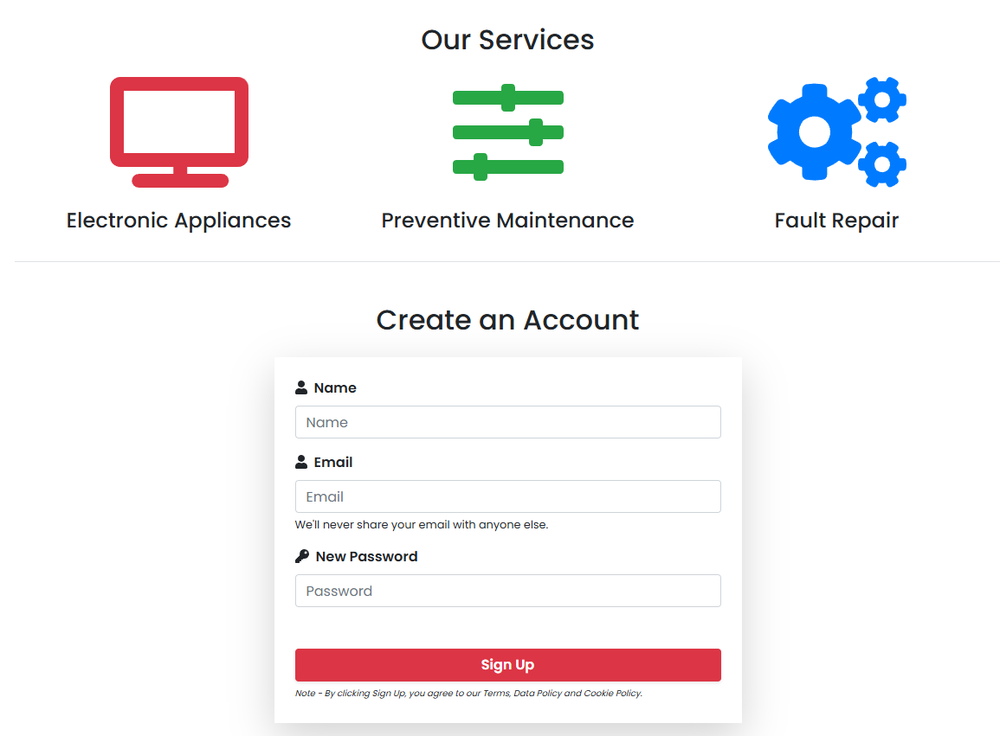
  <br>
  <br>
  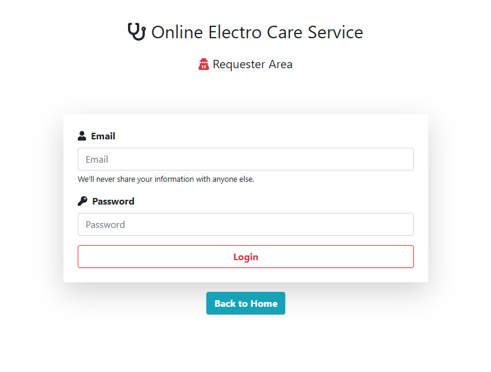
  <br>
  <br>
  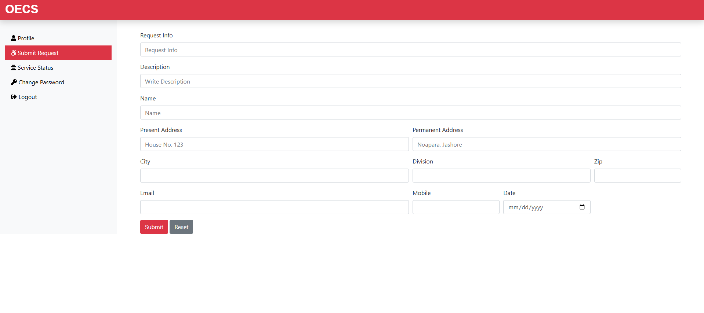
  <br>
  <br>
   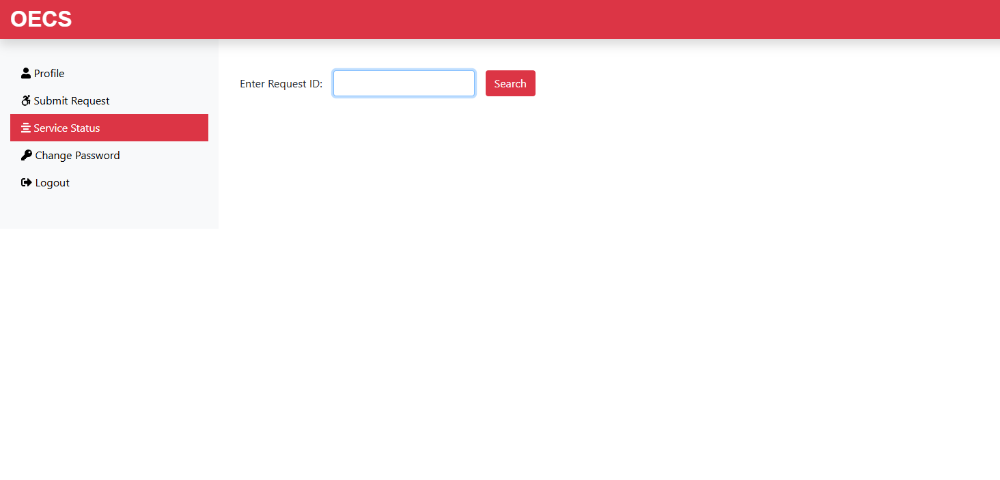
  <br>
  <br>
  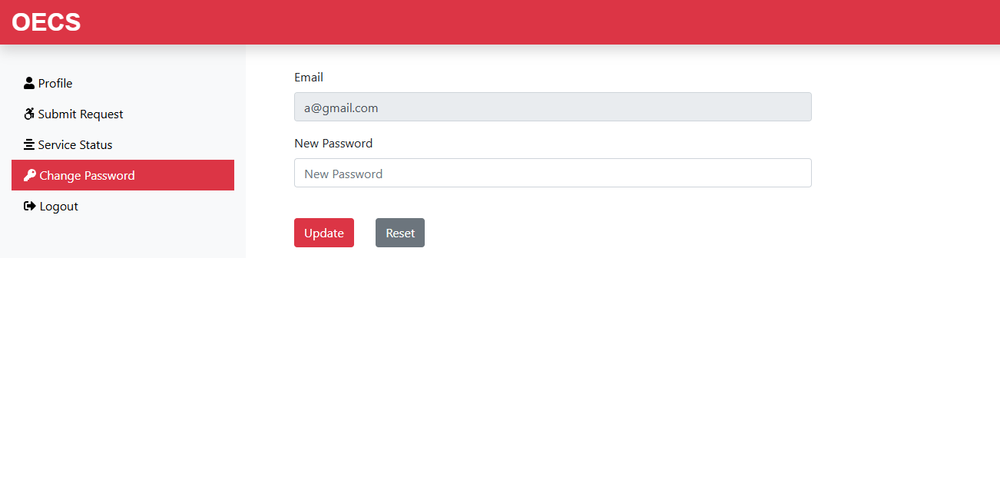
  <br>
  <br>
  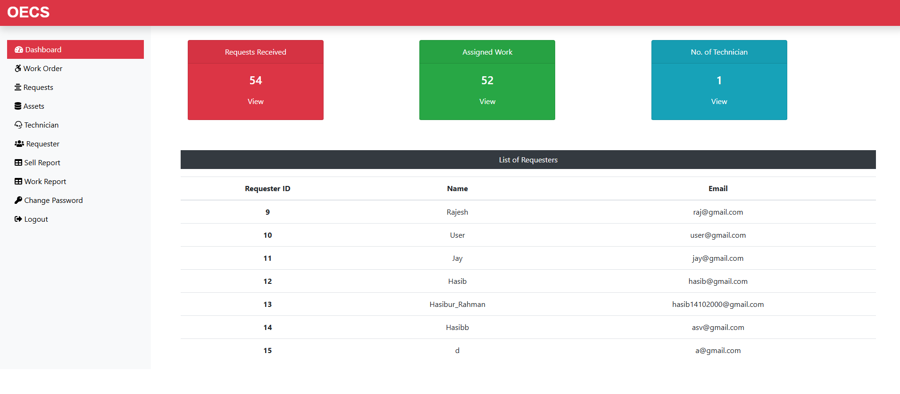
  <br>
  <br>
  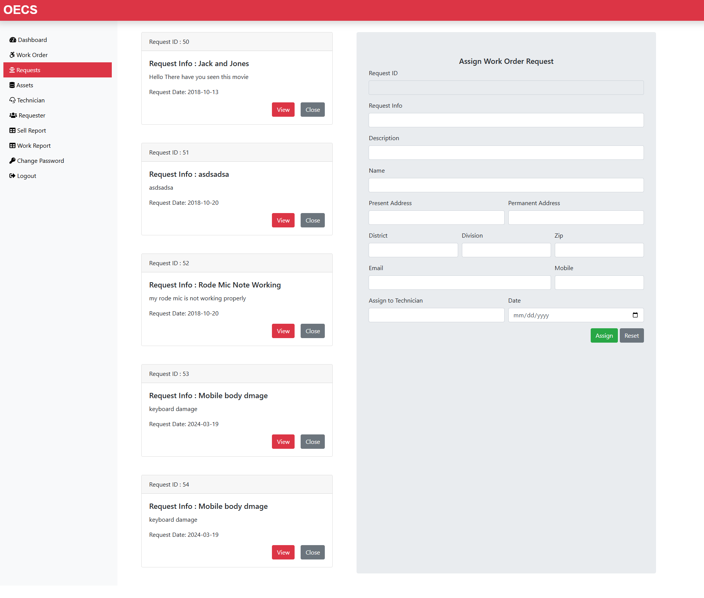
  <br>
  <br>
  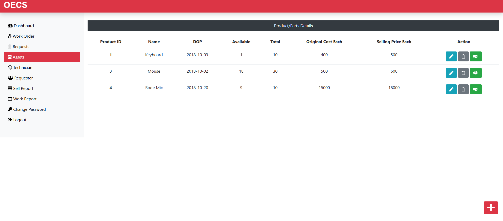
  <br>
  <br>
  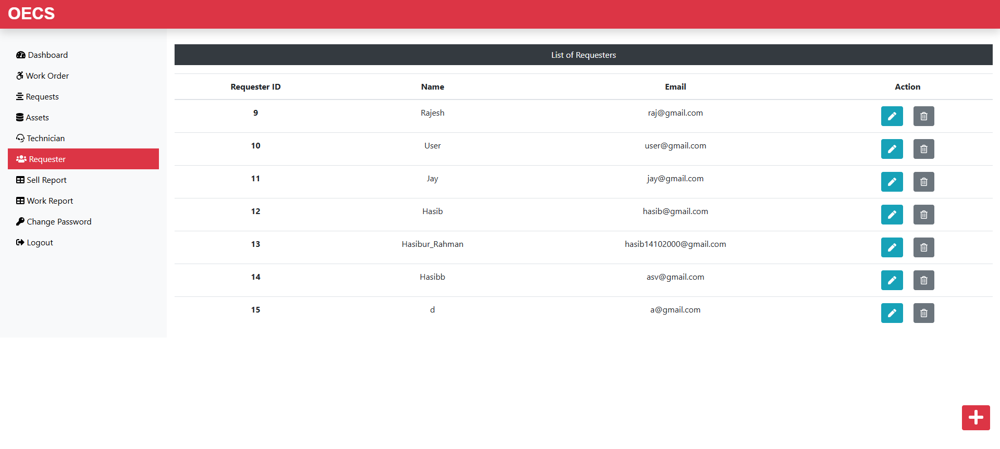
  <br>
  <br>
  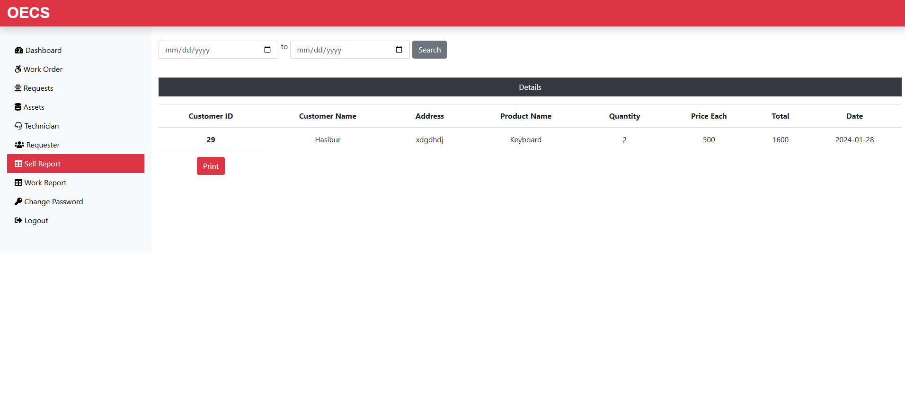
  <br>
  <br>
  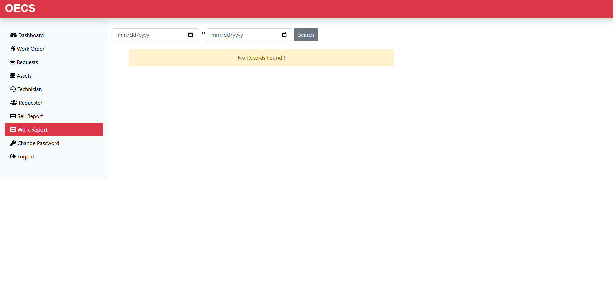
  <br>
  <br>
</p>


## Requirements 

* **Server :** A web server such as Apache (included in XAMPP).
* **PHP :** Version 7.4 or higher.
* **Database :** MySQL or MariaDB.
* **Browser :** Modern web browser (e.g., Chrome, Firefox, Edge).
* **Development Tools :** VSCode, XAMPP.
## Deployment

Accessing the project involves a few steps:

**Step 1:** Set up the Environment
*  Install XAMPP on your local machine to create a local development environment.

**Step 2 :** Clone the repository
```
    git clone https://github.com/Hasib-17/Online-Electro-Care-Service.git

```

**Step 3 :** Configure the Database

* Create a MySQL database and import the provided SQL scripts to set up the necessary tables and data.

**Step 4 :** Configure the Application

*  Update the database configuration in the config.php file with your database credentials.

**Step 5 :** Run the Application

* Start the Apache and MySQL services in XAMPP, and access the application via your web browser at http://localhost/5000.

## Conclusion

The OECS is a robust solution for businesses looking to streamline their service operations. With its powerful features, including a dashboard, login system, user panel, and admin panel, it simplifies the management of service requests, scheduling, and customer data. This system enhances efficiency and customer satisfaction, making it an ideal choice for businesses of all sizes. Whether you're a small business or a larger enterprise, this system can be tailored to meet your specific needs and help you deliver exceptional service to your customers.